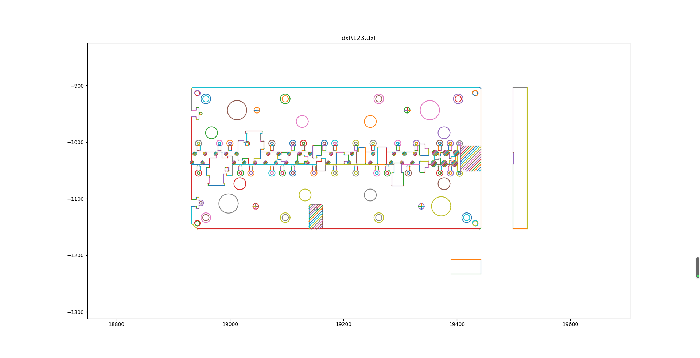

C#开源库netDxf解析AUTOCAD的图纸,获取基本形状(圆，圆弧，直线，多段线)的坐标等信息


<!--more-->

除了官方的AUTOCAD.NET外最合适的第三方开源类库是netDxf。  
netDxf is a .net library programmed in C# to read and write AutoCAD dxf files.   

## netDxf解析示例代码
目前验证过的Entity有Arc, Circle, Insert, Line, LwPolyline (light weight polyline).  
1.引入netDxf的package   
2.示例代码
```csharp
/// <summary>
/// 查找Insert里面的特定entity
/// </summary>
/// <typeparam name="T"></typeparam>
/// <param name="dxf"></param>
/// <param name="layer_filter"></param>
/// <returns></returns>
private static List<ResultBase<T>> GetEntities<T>(DxfDocument dxf, List<string> layer_filter) where T : EntityObject
{
    List<ResultBase<T>> t = new List<ResultBase<T>>();
    foreach (var item in dxf.Inserts.Where(r => layer_filter.Contains(r.Layer.Name)))
    {
        var block = item.Block;
        var entities = block.Entities
            .Where(r => (r as T) != null)
            .Cast<T>()
            .ToList();
        var sub_inserts = block.Entities
            .Where(r => (r as Insert) != null)
            .Cast<Insert>()
            .Where(r => r.Block.Entities.Count(s => (s as T) != null) > 0);
        var p_block = item.Position;
        foreach (var line in entities)
            t.Add(new ResultBase<T>() { base_point = new Point(p_block.X, p_block.Y, p_block.Z), result = line });
        foreach (var insert in sub_inserts)
        {
            var sb = insert.Block;
            var sub_entities = insert.Block.Entities.Where(r => (r as T) != null).Cast<T>().ToList();
            var p_sublock = insert.Position;
            foreach (var line in sub_entities)
                t.Add(new ResultBase<T>() { base_point = new Point(p_block.X + p_sublock.X, p_block.Y + p_sublock.Y, p_block.Z + p_sublock.Z), result = line });
        }
    }

    return t;
}

internal class ResultBase<T> where T : EntityObject
{
    public Point base_point { get; set; }
    public T result { get; set; }
}
```

## PYTHON解决方案
选择的开源类库是ezdxf，绘制图形选择matplotlib  
1.dxf文件解析
```python
import ezdxf
import os
from gooey import Gooey, GooeyParser


class ParseDxf(object):
    def __init__(self, file, layer_filter, is_save):
        super(ParseDxf, self).__init__()
        self.dwg = ezdxf.readfile(file)
        self.layer_filter = layer_filter
        self.save_file = is_save
        self.file_name = os.path.basename(file)

    def __del__(self):
        pass

    def init_header(self):
        self.ext_min = self.dwg.header['$EXTMIN']  # 左下角坐标
        self.ext_max = self.dwg.header['$EXTMAX']  # 右上角坐标
        header = "{0},{1},{2},{3}".format(
            self.ext_min[0], self.ext_min[1], self.ext_max[0], self.ext_max[1])
        if self.save_file:
            with open("{0}.header.txt".format(self.file_name), "w") as f:
                f.writelines(header)
        return (self.ext_min[0], self.ext_min[1], self.ext_max[0], self.ext_max[1]) 

    def find_entities(self, entity_type='LINE'):
        '''
        @description: dxf中查找modespace中的直线，和blockspace中的直线
        @param {type} 
        @return: List[(start_x, start_y, end_x, end_y), ...]
        '''
        entities = []
        msp = self.dwg.modelspace()

        # 1.外层的LINE
        outer_lines = msp.query(entity_type)
        outer_lines = [
            c for c in outer_lines if c.dxf.layer in self.layer_filter]
        b_point = (0, 0)
        if outer_lines:
            entities.append((b_point, outer_lines))

        # 2.BLOCK筛选出insert引用的BLOCK，然后查询出有LINE的
        sign = 1
        bsp = self.dwg.layouts_and_blocks()
        for block in bsp:
            nest_insert = block.query("INSERT")
            for i in nest_insert:
                if i.dxf.layer not in self.layer_filter:
                    continue
                sign = i.dxf.extrusion[2]
                sub_base_point = i.dxf.insert
                sub_block = self.dwg.blocks.get(i.dxf.name)
                # 1.insert 中的LINE
                b_point = (sign * (sub_base_point[0]), sub_base_point[1])
                nest_lines = sub_block.query(entity_type)
                nest_lines = [c for c in nest_lines]
                if nest_lines:
                    entities.append((b_point, nest_lines))

        #
        return entities

    def find_lines(self):
        '''
        @description: dxf中查找modespace中的直线，和blockspace中的直线
        @param {type} 
        @return: List[(start_x, start_y, end_x, end_y), ...]
        '''
        lines = []
        result = self.find_entities("LINE")
        for row in result:
            base_point = row[0]
            entities = row[1]
            for c in entities:
                start_x = base_point[0] + c.dxf.start[0]
                # start_x = abs(sub_base_point[0]) + c.dxf.start[0]
                start_y = base_point[1] + c.dxf.start[1]
                end_x = base_point[0] + c.dxf.end[0]
                # end_x = abs(sub_base_point[0]) + c.dxf.end[0]
                end_y = base_point[1] + c.dxf.end[1]
                lines.append((start_x, start_y, end_x, end_y))

        print(len(lines))
        if self.save_file:
            s_lines = []
            for r in lines:
                s = "{0},{1}|{2},{3}\n".format(r[0], r[1], r[2], r[3])
                s_lines.append(s)
            with open("{0}.line1.txt".format(self.file_name), "w") as f:
                f.writelines(s_lines)
        #
        return lines

    def find_lwpolylines(self):
        '''
        @description: dxf中查找modespace中的多段线，和blockspace中的多段线
        @param {type} 
        @return: List[(is_closed, [(x,y,b),x,y,b),...]), ...]
                p->format='xyseb',
                x	x coordinate
                y	y coordinate
                s	start width
                e	end width
                b	bulge value
                v	(x, y) as tuple
        '''
        polylines = []
        result = self.find_entities("LWPOLYLINE")
        for row in result:
            base_point = row[0]
            entities = row[1]
            for c in entities:
                list_v = []
                for p in c.get_points():
                    # p->format='xyseb',
                    x = base_point[0]+p[0]
                    y = base_point[1]+p[1]
                    b = p[4]
                    v = x, y, b  # tuple的赋值方式
                    list_v.append(v)
                print(list_v)
                polylines.append((c.closed, list_v))

        print(len(polylines))
        if self.save_file:
            lines = []
            for r in polylines:
                is_close = r[0]
                list_v = r[1]
                print(list_v)
                s = "{0}->{1}\n".format(
                    is_close,
                    "|".join([",".join((str(x[0]), str(x[1]), str(x[2])))
                              for x in list_v]),
                )
                lines.append(s)
            # print(lines)
            with open("{0}.polyline1.txt".format(self.file_name), "w") as f:
                f.writelines(lines)
        #
        return polylines

    def find_circles(self):
        '''
        @description: dxf中查找modespace中的圆，和blockspace中的圆
        @param {type} 
        @return: List[(center_x, center_y, radius), ...]
        '''
        circles = []
        result = self.find_entities("CIRCLE")
        for row in result:
            base_point = row[0]
            entities = row[1]
            for c in entities:
                cx = base_point[0] + c.dxf.center[0]
                cy = base_point[1] + c.dxf.center[1]
                circles.append((cx, cy, c.dxf.radius))

        print(len(circles))
        if self.save_file:
            lines = []
            for r in circles:
                s = "{0},{1},{2}\n".format(r[0], r[1], r[2])
                lines.append(s)
            with open("{0}.circle.txt".format(self.file_name), "w") as f:
                f.writelines(lines)
        #
        return circles

    def find_arcs(self):
        '''
        @description: dxf中查找modespace中的圆弧，和blockspace中的圆弧
        @param {type} 
        @return: List[(center_x, center_y, radius, start_angle, end_angle), ...]
        '''
        arcs = []
        result = self.find_entities("ARC")
        for row in result:
            base_point = row[0]
            entities = row[1]
            for c in entities:
                cx = base_point[0] + c.dxf.center[0]
                cy = base_point[1] + c.dxf.center[1]
                radius = c.dxf.radius
                start_angle = c.dxf.start_angle
                end_angle = c.dxf.end_angle
                arcs.append((cx, cy, radius, start_angle, end_angle))

        print(len(arcs))
        if self.save_file:
            lines = []
            for r in arcs:
                s = "{0},{1},{2},{3},{4}\n".format(
                    r[0], r[1], r[2], r[3], r[4])
                # print(s)
                lines.append(s)
            # print(lines)
            with open("{0}.arc.txt".format(self.file_name), "w") as f:
                f.writelines(lines)
        #
        return arcs

    def find_texts(self):
        '''
        @description: 
        @param {type} 
        @return: 
        '''
        texts = []
        result = self.find_entities("TEXT")
        for row in result:
            base_point = row[0]
            entities = row[1]
            for c in entities:
                cx = base_point[0] + c.dxf.insert[0]
                cy = base_point[1] + c.dxf.insert[1]
                text = c.dxf.text
                # align_point = c.dxf.align_point
                height=  c.dxf.height
                rotation = c.dxf.rotation
                style = c.dxf.style
                width = c.dxf.width
                halign = c.dxf.halign
                valign = c.dxf.valign
                text_generation_flag = c.dxf.text_generation_flag
                # radius = c.dxf.radius
                # start_angle = c.dxf.start_angle
                # end_angle = c.dxf.end_angle
                # texts.append((cx, cy, radius, start_angle, end_angle))
                texts.append((cx, cy, text, rotation))

        print(len(texts))
        # if self.save_file:
        #     lines = []
        #     for r in texts:
        #         s = "{0},{1},{2},{3},{4}\n".format(
        #             r[0], r[1], r[2], r[3], r[4])
        #         # print(s)
        #         lines.append(s)
        #     # print(lines)
        #     with open("{0}.arc.txt".format(self.file_name), "w") as f:
        #         f.writelines(lines)
        #
        return texts


@Gooey(program_name="DXF查看软件")
def main():
    parser = GooeyParser(description='打开DXF文件,绘制里面的圆、圆弧、多段线和直线')
    # 1.dxf路径
    parser.add_argument(
        "dxf_path",
        widget="FileChooser",
        metavar='DXF文件路径',
        help='填写DXF文件路径,绝对路径或相对路径')
    # 2.选择图层
    parser.add_argument(
        'layers',
        metavar='图层',
        default='DB',
        help='逗号分隔,只显示设定图层内的元素')
    # 3.可选
    parser.add_argument(
        "-s", "--save_file",
        default='yes',
        choices=['yes', 'no'],
        metavar='文件',
        help="是否输出坐标文件")

    args = parser.parse_args()
    print(args.dxf_path, args.layers, args.save_file)

    filename = args.dxf_path
    layer_filter = [x.strip() for x in args.layers.split(',')]
    is_save = args.save_file.lower() == "yes"
    # layer_filter = ['DB']
    #
    parse_and_draw(filename, layer_filter, is_save)


def parse_and_draw(filename, layer_filter, is_save):
    '''
    @description: 解析和绘制
    @param {type} 
    @return: 
    '''
    model = ParseDxf(filename, layer_filter, is_save)
    x1,y1,x2,y2 = model.init_header()
    
    texts = model.find_texts()
    circles = model.find_circles()
    arcs = model.find_arcs()
    polylines = model.find_lwpolylines()
    lines = model.find_lines()
    # #
    from draw_dxf import DrawDxf  
    draw = DrawDxf(filename,x1,y1,x2,y2)
    draw.draw_circles(circles)
    draw.draw_texts(texts)
    
    draw.draw_arcs(arcs)
    draw.draw_polylines(polylines)
    draw.draw_lines(lines)
    draw.show()


if __name__ == '__main__':
    # main()

    filename = r'dxf\123.dxf'
    layer_filter = ['DB','TEXT']
    is_save = False
    parse_and_draw(filename, layer_filter, is_save)

```  
2.绘制脚本
```py
"""
@Author: liujinquan
@Date: 2019-07-29 09:21:06
@LastEditors: liujinquan
@LastEditTime: 2019-07-30 20:21:20
@Description: file content
"""
import datetime
import math
import os
import sys
import time
from collections import Counter
from functools import wraps
from itertools import islice

import matplotlib.patches as mpatches
import matplotlib.pyplot as plt
import numpy as np

sys.path.insert(0, os.path.abspath(".."))


def timeit_inner(func):
    '''类函数的计时装饰器'''

    @wraps(func)
    def inner(self, *args, **kwargs):
        start = datetime.datetime.now()
        ret = func(self, *args, **kwargs)
        end = datetime.datetime.now()
        print('used:', (end - start).microseconds, "us")
        return ret

    return inner


class DrawDxf(object):
    def __init__(self, title, x1, y1, x2, y2):
        super(DrawDxf, self).__init__()
        self.init_plt(title, x1, y1, x2, y2)

    def __del__(self):
        plt.close()

    def init_plt(self, title, x1, y1, x2, y2):
        self.fig = plt.figure()
        self.axes = self.fig.add_subplot(111)
        self.axes.axis("equal")
        self.axes.cla()  # clear things for fresh plot
        plt.title(title)
    

    def show(self):
        # plt.xlim((18900, 19600))
        # plt.ylim((-1700, -400))
        plt.show()

    @property
    def ax(self):
        return self.ax

    def draw_circles(self, circles):
        """
        @description: 绘制圆
        @param: List[Tuple(float, float, float), ...], 
                like 'List[(center_x, center_y, radius), ...]'
        @return: none
        """
        for c in circles:
            a = c[0]
            b = c[1]
            r = c[2]
            theta = np.arange(0, 2 * np.pi, 0.01)
            x = a + r * np.cos(theta)
            y = b + r * np.sin(theta)
            plt.plot(x, y)
            # self.circle_artist((a, b), r, self.axes)
            print("circle->"+str(c))

    def draw_arcs(self, arcs):
        """
        @description: 绘制圆弧
        @param: List[(center_x, center_y, radius, start_angle, end_angle), ...]
        @return: 
        """
        for c in arcs:
            a = c[0]
            b = c[1]
            r = c[2]
            s_angle = c[3]
            e_angle = c[4]

            if(s_angle > e_angle):
                s_angle = s_angle - 360
            theta = np.arange(
                s_angle * np.pi / 180, e_angle * np.pi / 180, 0.01
            )
            x = a + r * np.cos(theta)
            y = b + r * np.sin(theta)
            plt.plot(x, y)
            # self.arc_patch((a, b), r, (s_angle) * np.pi /
            #                180, e_angle * np.pi / 180)
            print("arc->"+str(c))

    def draw_lines(self, lines):
        """
        @description: 绘制直线
        @param: List[(start_x, start_y, end_x, end_y), ...]
        @return: 
        """
        for line in lines:
            x = [line[0], line[2]]
            y = [line[1], line[3]]
            plt.plot(x, y)
            print("line->"+str(line))

    def draw_polylines(self, polys):
        """
        @description: 绘制多段线
            使用前后两个点绘制其中一段,收尾连接(闭合)。
            其中凸度取前一个顶点的数据
        @param {type} (start_x, start_y, bulge)
        @param is_close, string, -> 'true', or 'false'
                List[(is_closed, [(x,y,b),x,y,b),...]), ...]
        @return: 
        """
        for poly in islice(polys, 0, None):
            begin = datetime.datetime.now()
            is_closed = poly[0]
            vs = poly[1]  # 顶点集合
            cnt = len(vs)
            if not is_closed:
                cnt = cnt - 1
            for i in range(0, cnt):
                start = i
                end = (i + 1) % len(vs)
                start_x = vs[start][0]
                start_y = vs[start][1]
                bulge = vs[start][2]
                end_x = vs[end][0]
                end_y = vs[end][1]
                # bulge = polys[end][2]
                self.draw_polylines_sub(start_x, start_y, end_x, end_y, bulge)
                print("polyline->"+str((start_x, start_y, end_x, end_y, bulge)))

    def draw_texts(self, texts):
        for text in texts:
            x = text[0]
            y = text[1]
            s = text[2]
            rot = text[3]
            plt.text(x, y, s, rotation=rot)

    # @timeit_inner
    def draw_polylines_sub(self, start_x, start_y, end_x, end_y, bulge):
        """
        @description: 绘制多线段的绘制函数
            考虑到浮点数的精度，小于0.1直接使用直线代替，
            凸度不为零的，则是圆弧，需要根据两点和凸度计算圆心，半径，起始角度和终止角度
        @param {type} 
        @return: 
        """
        x = (start_x, end_x)
        y = (start_y, end_y)
        if bulge > -0.1 and bulge < 0.1:
            plt.plot(x, y)
        else:
            center_x, center_y, r, s_angle, e_angle = self.calc_center_radius_angle_by_pos(
                start_x, start_y, end_x, end_y, bulge)

            theta = np.arange((s_angle) * np.pi / 180,
                              e_angle * np.pi / 180, np.sign(bulge) * 0.01)
            x = center_x + r * np.cos(theta)
            y = center_y + r * np.sin(theta)
            plt.plot(x, y)
            # self.arc_patch((center_x, center_y,), r, (s_angle)
            #                * np.pi / 180, e_angle * np.pi / 180)

    def arc_patch(self, center, radius, theta1, theta2, ax=None, resolution=100, **kwargs):
        '''
        @description: 绘制圆弧的另外一种方法
        @param {type} 
        @return: 
        '''
        # make sure ax is not empty
        if ax is None:
            ax = plt.gca()
        # generate the points
        theta = np.linspace(np.radians(theta1), np.radians(theta2), resolution)
        points = np.vstack((radius*np.cos(theta) + center[0],
                            radius*np.sin(theta) + center[1]))
        # build the polygon and add it to the axes
        poly = mpatches.Polygon(points.T, closed=False, **kwargs)
        ax.add_patch(poly)
        # arc = mpatches.Arc(center, radius, radius, np.radians(theta1), np.radians(theta2))
        # ax.add_patch(arc)
        return arc

    def circle_artist(self, center, radius,  ax=None, **kwargs):
        if ax is None:
            ax = plt.gca()
        circle = plt.Circle(center, radius, fill=False)
        # circle.set_edgecolor(None)
        ax.add_artist(circle)
        return circle

    def readfile_drawcircle(self, filename):
        """
        @description: 读数据文件并画圆
        @param {type} 
        @return: 
        """
        with open(filename, "r") as f:
            lines = f.readlines()
        list1 = []
        for line in lines:
            a = [float(s) for s in line.strip("\n").split(",")]
            list1.append(a)
        self.draw_circles(list1)

    def readfile_drawarc(self, filename):
        """
        @description: 读数据文件并绘制圆弧
        @param {type} 
        @return: 
        """
        with open(filename, "r") as f:
            lines = f.readlines()
        list1 = []
        for line in lines:
            a = [float(s) for s in line.strip("\n").split(",")]
            list1.append(a)
        self.draw_arcs(list1)

    def readfile_drawpolyline(self, filename):
        """
        @description: 读数据并绘制多段线
        @param {type} 
        @return: 
        """
        with open(filename, "r") as f:
            lines = f.readlines()
        for line in lines:
            is_close = line.split(">")[0]
            line = line.split(">")[1]
            list_line = []
            pos = [s for s in line.strip("\n").split("|")]
            for p in pos:
                list_line.append([float(s) for s in p.split(",")])
            self.draw_polylines(list_line, is_close)

    def readfile_drawline(self, filename):
        """
        @description: 读文件并绘制线段
        @param {type} 
        @return: 
        """
        with open(filename, "r") as f:
            lines = f.readlines()
        for line in lines:
            list_line = []
            pos = [s for s in line.strip("\n").split("|")]
            for p in pos:
                list_line.append([float(s) for s in p.split(",")])
            self.draw_lines(list_line)

    def calc_center_by_bulge(self, start_x, start_y, end_x, end_y, bulge):
        """
        @description: 两点和凸度,计算圆心。
        @param {type} 
        @return: 
        """
        bulge = 0.5 * (1 / bulge - bulge)
        center_x = 0.5 * ((start_x + end_x) - (end_y - start_y) * bulge)
        center_y = 0.5 * ((start_y + end_y) + (end_x - start_x) * bulge)
        return center_x, center_y

    def calc_radius_by_bulge(self, start_x, start_y, end_x, end_y, bulge):
        """
        @description: 两点和凸度,计算半径
        @param {type} 
        @return: 
        """
        # 1.求夹角角度
        theta = 4 * math.atan(bulge)  # 弧度
        angle = theta*180/np.pi
        # 2.求半径
        r = math.sqrt(
            math.pow((end_x - start_x), 2) + math.pow((end_y - start_y), 2)
        ) / abs((2 * math.sin(theta / 2)))
        return abs(r), angle

    def calc_center_radius_angle_by_pos(self, start_x, start_y, end_x, end_y, bulge):
        '''
        @description: 
        @param {type} 
        @return: 
        '''
        # 1.先计算圆心角
        center_x, center_y = self.calc_center_by_bulge(
            start_x, start_y, end_x, end_y, bulge)
        radius, angle_start2end = self.calc_radius_by_bulge(
            start_x, start_y, end_x, end_y, bulge)

        # 2. 计算起始线的角度
        angle_x2start = self.calc_angle_x2start(
            start_x,  start_y, center_x, center_y)
        # 3. 计算起始线的角度
        angle_x2end = angle_x2start + angle_start2end

        return center_x, center_y, radius, angle_x2start, angle_x2end

    def calc_angle_x2start(self, x,  y, center_x, center_y):
        # x = round(x, 2)
        # y = round(y, 2)
        # center_x = round(center_x, 2)
        # center_y = round(center_y, 2)
        angle_x2start = 0
        if abs(x - center_x) < 0.01 and y >= center_y:
            angle_x2start = (np.pi / 2) * 180 / np.pi
        elif abs(x - center_x) < 0.01 and y < center_y:
            angle_x2start = (-np.pi / 2) * 180 / np.pi
        elif abs(y - center_y) < 0.01 and x >= center_x:
            angle_x2start = 0
        elif abs(y - center_y) < 0.01 and x < center_x:
            angle_x2start = np.pi * 180 / np.pi
        else:
            theta = math.atan((y - center_y) / (x - center_x))
            angle_x2start = theta * 180 / np.pi
            angle_x2start = abs(angle_x2start)
            # 第一象限
            if x > center_x and y > center_y:
                angle_x2start = angle_x2start
            elif x < center_x and y > center_y:
                angle_x2start = 180 - angle_x2start
            elif x < center_x and y < center_y:
                angle_x2start = -(180 - angle_x2start)
            elif x > center_x and y < center_y:
                angle_x2start = -angle_x2start
        return angle_x2start


def print_layers(counter):
    """
    @description: 
    @param {type} 
    @return: 
    """
    print("used Layers: {}".format(len(counter)))
    for item in sorted(counter.items()):
        print("Layer: {} has {} entities".format(*item))


if __name__ == "__main__":
    # test()

    filename = "PD190199104-D05A"
    model = DrawDxf(r"{0}.dxf".format(filename))
    model.readfile_drawcircle(r"{0}.dxf.circle.txt".format(filename))
    model.readfile_drawarc(r"{0}.dxf.arc.txt".format(filename))
    model.readfile_drawpolyline(r"{0}.dxf.poly.txt".format(filename))
    model.readfile_drawline(r"{0}.dxf.line.txt".format(filename))
    model.show()
```


## 补充使用opencv-python绘制的代码
```python
"""
@Description: In User Settings Edit
@Author: your name
@Date: 2019-08-07 20:00:04
@LastEditTime: 2019-08-07 22:04:54
@LastEditors: Please set LastEditors
"""


import math

import cv2 as cv
import numpy as np


class DrawDxfCv(object):
    def __init__(self, x1, y1, x2, y2):
        super(DrawDxfCv, self).__init__()
        self.init_img(x1, y1, x2, y2)
        self.offset = (-100, -100)
        self.x1 = x1
        self.y1 = y1
        print(x2 - x1, y2 - y1)

    def init_img(self, x1, y1, x2, y2):
        print(x1, y1, x2, y2)
        self.img = np.zeros((int(abs(x2 - x1) * 2), int(abs(y2 - y1) * 2), 3), np.uint8)
        self.pointer_color = (0, 0, 255)
        self.thickness = 1

    def draw_circles(self, circles):
        """
        @description: 绘制圆
        @param: List[Tuple(float, float, float), ...], 
                like 'List[(center_x, center_y, radius), ...]'
        @return: none
        """
        cp = np.array(circles)
        self.x1, self.y1 = cp.min(0)[0] + self.offset[0], cp.min(0)[1] + self.offset[1]
        ratio = 2
        cv.circle(self.img, (0, 0), 5, self.pointer_color, self.thickness)
        for c in circles:
            a = c[0]
            b = c[1]
            r = c[2]
            point = (int(a - self.x1) * ratio, int(abs(b - self.y1)) * ratio)
            point_size = int(r) * ratio
            # print(point)
            cv.circle(self.img, point, point_size, self.pointer_color, self.thickness)

    def draw_arcs(self, arcs):
        """
        @description: 绘制圆弧
        @param: List[(center_x, center_y, radius, start_angle, end_angle), ...]
        @return: 
        """
        ratio = 2
        for c in arcs:
            a = abs(int(c[0] - self.x1)) * ratio
            b = abs(int(c[1] - self.y1)) * ratio
            r = abs(int(c[2])) * ratio
            s_angle = abs(int(c[3]))
            e_angle = abs(int(c[4]))
            if s_angle > e_angle:
                s_angle = s_angle - 360
            # cv::ellipse(image, center, cv::Size(radius, radius), angle, start_angle, end_angle, cv::Scalar(255, 255, 255));
            cv.ellipse(
                self.img, (a, b), (r, r), 0, s_angle, e_angle, (255, 255, 255), 1
            )

    def draw_lines(self, lines):
        """
        @description: 绘制直线
        @param: List[(start_x, start_y, end_x, end_y), ...]
        @return: 
        """
        # cv2.line(img, Point pt1, Point pt2, color, thickness=1, line_type=8, shift=0)
        ratio = 2
        for line in lines:
            # x = [line[0], line[2]]
            # y = [line[1], line[3]]
            start_x = abs(int(line[0] - self.x1)) * ratio
            start_y = abs(int(line[1] - self.y1)) * ratio
            end_x = abs(int(line[2] - self.x1)) * ratio
            end_y = abs(int(line[3] - self.y1)) * ratio
            cv.line(self.img, (start_x, start_y), (end_x, end_y), (0, 255, 255), 1)

    def draw_polylines(self, polylines):
        """
        @description: 绘制多段线
            使用前后两个点绘制其中一段,收尾连接(闭合)。
            其中凸度取前一个顶点的数据
        @param {type} (start_x, start_y, bulge)
        @param is_close, string, -> 'true', or 'false'
                List[(is_closed, [(x,y,b),x,y,b),...]), ...]
        @return: 
        """
        for poly in polylines:
            is_closed = poly[0]
            vs = poly[1]  # 顶点集合
            cnt = len(vs)
            if not is_closed:
                cnt = cnt - 1
            for i in range(0, cnt):
                start = i
                end = (i + 1) % len(vs)
                start_x = vs[start][0]
                start_y = vs[start][1]
                bulge = vs[start][2]
                end_x = vs[end][0]
                end_y = vs[end][1]
                self.draw_polylines_sub(start_x, start_y, end_x, end_y, bulge)

    def draw_polylines_sub(self, start_x, start_y, end_x, end_y, bulge):
        """
        @description: 绘制多线段的绘制函数
            考虑到浮点数的精度，小于0.1直接使用直线代替，
            凸度不为零的，则是圆弧，需要根据两点和凸度计算圆心，半径，起始角度和终止角度
        @param {type} 
        @return: 
        """
        ratio = 2
        # start_x = abs(start_x)
        # start_y = abs(start_y)
        # end_x = abs(end_x)
        # end_y = abs(end_y)
        if bulge > -0.1 and bulge < 0.1:
            start_x = int(start_x - self.x1) * ratio
            start_y = abs(int(start_y - self.y1)) * ratio
            end_x = int(end_x - self.x1) * ratio
            end_y = abs(int(end_y - self.y1)) * ratio
            print(start_x, start_y, end_x, end_y)
            cv.line(self.img, (start_x, start_y), (end_x, end_y), (0, 255, 255), 1)
        else:
            center_x, center_y, r, s_angle, e_angle = self.calc_center_radius_angle_by_pos(
                start_x, start_y, end_x, end_y, bulge
            )
            center_x = int(center_x - self.x1) * ratio
            center_y = abs(int(center_y - self.y1)) * ratio
            r = int(r) * ratio
            cv.ellipse(
                self.img,
                (center_x, center_y),
                (r, r),
                0,
                int(s_angle),
                int(e_angle),
                (255, 255, 255),
                1
            )
            # cv.ellipse(
            #     self.img, (a, b), (r, r), 0, s_angle, e_angle, (255, 255, 255), 1
            # )

    def calc_center_by_bulge(self, start_x, start_y, end_x, end_y, bulge):
        """
        @description: 两点和凸度,计算圆心。
        @param {type} 
        @return: 
        """
        bulge = 0.5 * (1 / bulge - bulge)
        center_x = 0.5 * ((start_x + end_x) - (end_y - start_y) * bulge)
        center_y = 0.5 * ((start_y + end_y) + (end_x - start_x) * bulge)
        return center_x, center_y

    def calc_radius_by_bulge(self, start_x, start_y, end_x, end_y, bulge):
        """
        @description: 两点和凸度,计算半径
        @param {type} 
        @return: 
        """
        # 1.求夹角角度
        theta = 4 * math.atan(bulge)  # 弧度
        angle = theta * 180 / np.pi
        # 2.求半径
        r = math.sqrt(
            math.pow((end_x - start_x), 2) + math.pow((end_y - start_y), 2)
        ) / abs((2 * math.sin(theta / 2)))
        return abs(r), angle

    def calc_center_radius_angle_by_pos(self, start_x, start_y, end_x, end_y, bulge):
        """
        @description: 
        @param {type} 
        @return: 
        """
        # 1.先计算圆心角
        center_x, center_y = self.calc_center_by_bulge(
            start_x, start_y, end_x, end_y, bulge
        )
        radius, angle_start2end = self.calc_radius_by_bulge(
            start_x, start_y, end_x, end_y, bulge
        )

        # 2. 计算起始线的角度
        angle_x2start = self.calc_angle_x2start(start_x, start_y, center_x, center_y)
        # 3. 计算起始线的角度
        angle_x2end = angle_x2start + angle_start2end

        return center_x, center_y, radius, angle_x2start, angle_x2end

    def calc_angle_x2start(self, x, y, center_x, center_y):
        # x = round(x, 2)
        # y = round(y, 2)
        # center_x = round(center_x, 2)
        # center_y = round(center_y, 2)
        angle_x2start = 0
        if abs(x - center_x) < 0.01 and y >= center_y:
            angle_x2start = (np.pi / 2) * 180 / np.pi
        elif abs(x - center_x) < 0.01 and y < center_y:
            angle_x2start = (-np.pi / 2) * 180 / np.pi
        elif abs(y - center_y) < 0.01 and x >= center_x:
            angle_x2start = 0
        elif abs(y - center_y) < 0.01 and x < center_x:
            angle_x2start = np.pi * 180 / np.pi
        else:
            theta = math.atan((y - center_y) / (x - center_x))
            angle_x2start = theta * 180 / np.pi
            angle_x2start = abs(angle_x2start)
            # 第一象限
            if x > center_x and y > center_y:
                angle_x2start = angle_x2start
            elif x < center_x and y > center_y:
                angle_x2start = 180 - angle_x2start
            elif x < center_x and y < center_y:
                angle_x2start = -(180 - angle_x2start)
            elif x > center_x and y < center_y:
                angle_x2start = -angle_x2start
        return angle_x2start

    def show(self):
        cv.namedWindow("image")
        cv.imshow("image", self.img)
        cv.waitKey(0)

    def close(self):
        cv.destroyAllWindows()


if __name__ == "__main__":
    cv = DrawDxfCv(0, 100, 0, 100)

```


