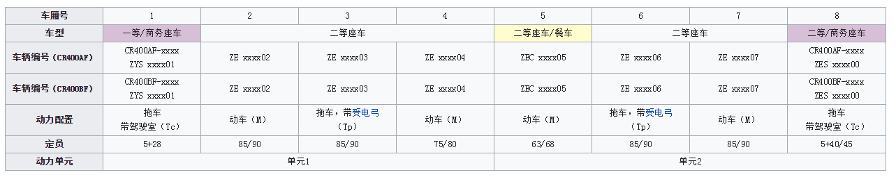

&nbsp;&nbsp;在远望谷曾经参与过动车组车辆检修系统，即动车组位置追踪系统。有一部分动车没有安装动车标签，只能是通过视频识别动车车厢侧面印刷的车厢号来判断动车组信息。而车辆号和编组的对应关系当时是从维基百科上获取的。当时是先将网页上的表格拷贝EXCEL文件，然后读取EXCEL文件后解析出相关数据。  
&nbsp;&nbsp;现在修改为直接从网页抓取并解析出需要的数据。


<!--more-->

以页面[https://zh.wikipedia.org/wiki/复兴号电力动车组](https://zh.wikipedia.org/wiki/复兴号电力动车组)为例，编组数据在下图的表格中

而车辆编号与车型对应关系在下图表格中


我们的脚本就是利用splinter模拟浏览器登陆指定网址，爬取表格内的数据。

crh1.py脚本
```python  
#-*- coding: utf-8 -*-
__author__='liujinquan'

import json
import traceback

import requests
from bs4 import BeautifulSoup as bsp

from models import model_crh


class Crh1(object):
    href = r'https://zh.wikipedia.org/wiki/复兴号电力动车组'

    def __init__(self):
        super(Crh1, self).__init__()

    def getSoup(self, url):
        '''使用request获取网页源代码,并传入bs'''
        headers = {
            'User-Agent':
            'Mozilla/5.0 (X11; Linux x86_64) AppleWebKit/537.36 (KHTML, like Gecko) Chrome/48.0.2564.116 Safari/537.36',
        }
        try:
            r = requests.get(url, headers=headers)
            r.encoding = 'utf-8'
            soup = bsp(r.text, "html.parser")
            return soup
        except Exception as identifier:
            print('getSoup ex:\n%s' % traceback.format_exc())
            return None

    def getGroups(self):
        soup = self.getSoup(self.href)
        if not soup:
            return None
        list_model_crh = []
        list_table = soup.find_all(
            'table',
            attrs={
                'class': 'wikitable',
                'style': 'width:100%; text-align: center; font-size: small;'
            })
        if list_table:
            # print(list_table)
            for table in list_table:
                # 查找tr并分组
                list_tr_all = table.find_all('tr')

                tr_colors = [
                    '#0033c9', '#0033C9', '#FF8000', '#1E3A91', '#EE0012',
                    '#CCA05C', '#cca05c'
                ]
                list_tr_crh = []
                for c in tr_colors:
                    list_tr_crh1 = table.find_all(
                        'tr',
                        attrs={
                            'align': 'center',
                            'bgcolor': '{0}'.format(c)
                        })
                    list_tr_crh.extend(list_tr_crh1)
                list_index = [list_tr_all.index(x) for x in list_tr_crh]
                # 将目标tr放在列表中
                list_tr_group = []
                lenth = len(list_index)
                for i in range(lenth):
                    if i < lenth - 1:
                        tr_s = list_tr_all[list_index[i]:list_index[i + 1]]
                    else:
                        tr_s = list_tr_all[list_index[i]:]
                    list_tr_group.append(tr_s)
                # 分析每一组得到想要的数据           
                for trs in list_tr_group:
                    title = trs[0].find('td').find('font').find('b').text
                    temp = trs[1:]
                    last_attch = ''
                    for tr in temp:
                        model = model_crh()
                        tds = tr.find_all('td')
                        attach_a = tds[0].find('a')
                        if attach_a:
                            last_attch = attach_a.text
                            tds = tds[1:]
                        model.crh_type = title
                        model.crh_attach = last_attch.strip()
                        try:
                            model.crh_count = tds[0].text.strip()
                            model.crh_group_no = tds[1].text.strip()
                            model.crh_yunyongsuo = tds[2].text.strip()
                            model.crh_line = ','.join(
                                [x.text for x in tds[3].find_all('a')])
                            model.crh_reamrk = tds[4].text.strip()
                        except:
                            print('find train info ex:\n%s' %
                                  traceback.format_exc())
                        print(
                            json.dumps(
                                model,
                                default=lambda obj: obj.__dict__,
                                ensure_ascii=False))
                        # with open('models.json', 'a') as f:
                        #     f.write('\n' + json.dumps(
                        #         model,
                        #         default=lambda obj: obj.__dict__,
                        #         ensure_ascii=False,
                        #         indent=4))
                        list_model_crh.append(model)
        return list_model_crh


if __name__ == '__main__':
    import time
    start = time.clock()

    crh1 = Crh1()
    crh1.getGroups()

    end = time.clock()
    print("程序运行总耗时: {0:02f} s".format(end - start))

```

crh2.py脚本(crh2车型的网页的表格与其他网页不同，需要单独编写脚本)
```python
#-*- coding: utf-8 -*-
__author__='liujinquan'

import json
import traceback

import requests
from bs4 import BeautifulSoup as bsp

from models import model_crh


class Crh2(object):
    href = r'https://zh.wikipedia.org/wiki/和谐号CRH2型电力动车组'

    def __init__(self):
        super(Crh2, self).__init__()

    def getSoup(self, url):
        '''使用request获取网页源代码,并传入bs'''
        headers = {
            'User-Agent':
            'Mozilla/5.0 (X11; Linux x86_64) AppleWebKit/537.36 (KHTML, like Gecko) Chrome/48.0.2564.116 Safari/537.36',
        }
        try:
            r = requests.get(url, headers=headers)
            r.encoding = 'utf-8'
            soup = bsp(r.text, "html.parser")
            return soup
        except Exception as identifier:
            print('getSoup ex:\n%s' % traceback.format_exc())
            return None

    def getGroups(self):
        soup = self.getSoup(self.href)
        if not soup:
            return None
        list_model_crh = []
        table_csses = [
            'mw-collapsible mw-collapsed wikitable',
        ]
        list_table = []
        for table_css in table_csses:
            list_temp = soup.find_all(
                'table',
                attrs={
                    'class': '{0}'.format(table_css),
                    'style': 'margin: 0 auto; width: 100%;'
                })
            list_table.extend(list_temp)
        for table in list_table:
            title = table.find('tbody').find('tr').find('th').text.strip()
            t_crh = table.find(
                'table',
                attrs={
                    'class': 'wikitable',
                    'style':
                    'width:100%; text-align: center; font-size: small;'
                })
            if t_crh:
                temp = t_crh.find_all('tr')[1:]
                last_attch = ''
                for tr in temp:
                    model = model_crh()
                    tds = tr.find_all('td')
                    attach_a = tds[0].find('a')
                    if attach_a:
                        last_attch = attach_a.text
                        tds = tds[1:]
                    model.crh_type = title
                    model.crh_attach = last_attch.strip()
                    try:
                        model.crh_count = tds[0].text.strip()
                        model.crh_group_no = tds[1].text.strip()
                        model.crh_yunyongsuo = tds[2].text.strip()
                        model.crh_line = ','.join(
                            [x.text for x in tds[3].find_all('a')])
                        model.crh_reamrk = tds[4].text.strip()
                    except:
                        print(
                            'find train info ex:\n%s' % traceback.format_exc())
                    print(
                        json.dumps(
                            model,
                            default=lambda obj: obj.__dict__,
                            ensure_ascii=False))
                    # with open('models.json', 'a') as f:
                    #     f.write('\n' + json.dumps(
                    #         model,
                    #         default=lambda obj: obj.__dict__,
                    #         ensure_ascii=False,
                    #         indent=4))
                    list_model_crh.append(model)
        return list_model_crh


if __name__ == '__main__':
    import time
    start = time.clock()

    crh2 = Crh2()
    crh2.getGroups()

    end = time.clock()
    print("程序运行总耗时: {0:02f} s".format(end - start))
```

最后是综合的crh_all.py脚本
```python
# encoding:utf-8
__author__ = "liujinquan"
__date__ = "2018/7/16"

import json

from crh1 import Crh1
from crh2 import Crh2

dic_url1 = {
    'CRH1': 'https://zh.wikipedia.org/wiki/和谐号CRH1型电力动车组',
    'CRH3': 'https://zh.wikipedia.org/wiki/和谐号CRH3型电力动车组',
    'CRH5': 'https://zh.wikipedia.org/wiki/和谐号CRH5型电力动车组',
    'CRH6': 'https://zh.wikipedia.org/wiki/和谐号CRH6型电力动车组',
    'CJ1': 'https://zh.wikipedia.org/wiki/和谐号CJ1型电力动车组',
    'CJ2': 'https://zh.wikipedia.org/wiki/和谐号CJ2型电力动车组',
    'CRH380A': 'https://zh.wikipedia.org/wiki/和谐号CRH380A型电力动车组',
    'CRH380B': 'https://zh.wikipedia.org/wiki/和谐号CRH380B型电力动车组',
    'CRH380C': 'https://zh.wikipedia.org/wiki/和谐号CRH380C型电力动车组',
    'CRH380D': 'https://zh.wikipedia.org/wiki/和谐号CRH380D型电力动车组',
    'CR': 'https://zh.wikipedia.org/wiki/中国标准动车组',  # 复兴号
}

dic_url2 = {
    'CRH2': 'https://zh.wikipedia.org/wiki/和谐号CRH2型电力动车组',
}

if __name__ == '__main__':
    import time
    start = time.clock()

    list_model_crh = []
    crh1 = Crh1()
    for v in dic_url1.values():
        crh1.href = v
        list_model_crh.extend(crh1.getGroups())

    crh2 = Crh2()
    for v in dic_url2.values():
        crh2.href = v
        list_model_crh.extend(crh2.getGroups())
    with open('models.json', 'a') as f:
        f.write('\n' + json.dumps(
            list_model_crh,
            default=lambda obj: obj.__dict__,
            ensure_ascii=False,
            indent=4))

    end = time.clock()
    print("程序运行总耗时: {0:02f} s".format(end - start))

```