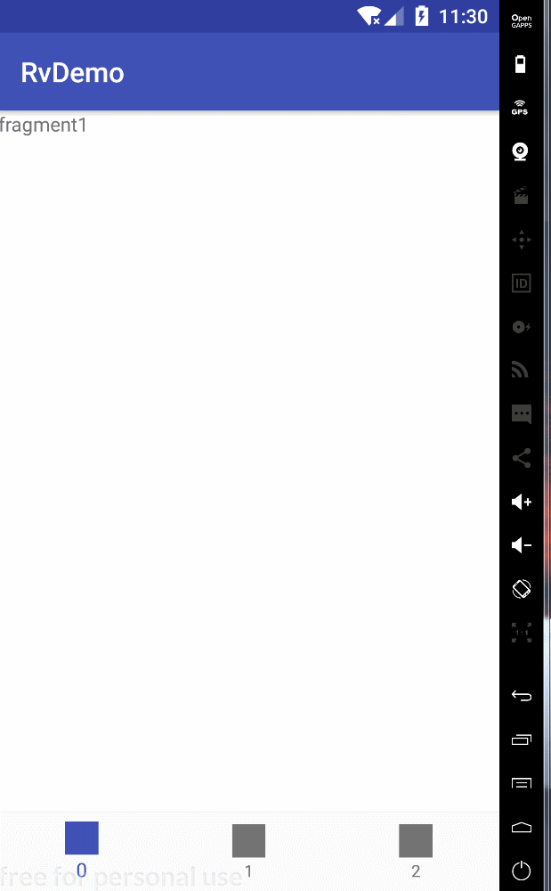

初学android, 记录开源工具的使用.


<!--more--> 

# 1 build.gradle
```
    api 'com.github.CymChad:BaseRecyclerViewAdapterHelper:2.9.22'
    implementation 'com.android.support:recyclerview-v7:27.1.1'
    implementation "com.android.support:design:27.1.1"
```
# 2 layout
```
<?xml version="1.0" encoding="utf-8"?>
<LinearLayout xmlns:android="http://schemas.android.com/apk/res/android"
    android:layout_width="match_parent"
    android:layout_height="match_parent"
    android:orientation="vertical">

    <android.support.v4.widget.SwipeRefreshLayout
        android:id="@+id/swipe_refresh_widget"
        android:layout_width="match_parent"
        android:layout_height="match_parent"
        >

        <android.support.v7.widget.RecyclerView
            android:id="@+id/recycler_view"
            android:layout_width="wrap_content"
            android:layout_height="wrap_content"
            android:cacheColorHint="@null"
            android:scrollbars="vertical"
            />

    </android.support.v4.widget.SwipeRefreshLayout>

</LinearLayout>
```
# 3 代码
```
package com.prafly.rvdemo;

import android.os.Bundle;
import android.support.v4.widget.SwipeRefreshLayout;
import android.support.v7.app.AppCompatActivity;
import android.support.v7.widget.LinearLayoutManager;
import android.support.v7.widget.RecyclerView;
import android.support.v7.widget.helper.ItemTouchHelper;
import android.util.TypedValue;
import android.widget.Toast;

import com.chad.library.adapter.base.BaseQuickAdapter;
import com.chad.library.adapter.base.callback.ItemDragAndSwipeCallback;

import java.util.ArrayList;
import java.util.List;

public class MainActivity extends AppCompatActivity implements SwipeRefreshLayout.OnRefreshListener {


    private RecyclerView recyclerView;
    private List<Model> datas;
    private MyAdapter adapter;
    private SwipeRefreshLayout mSwipeRefreshWidget;
    LinearLayoutManager layoutManager;

    private static final int PAGE_SIZE = 10;
    private int currentPage;
    private int lastPage;
    private int totalPageSize = 10;
    private int lastVisibleItem = 0;

    private void showToast(String msg) {
        Toast.makeText(this, msg, Toast.LENGTH_SHORT).show();
    }

    @Override
    protected void onCreate(Bundle savedInstanceState) {
        super.onCreate(savedInstanceState);
        setContentView(R.layout.activity_main);

        mSwipeRefreshWidget = findViewById(R.id.swipe_refresh_widget);
        mSwipeRefreshWidget.setColorSchemeResources(R.color.color1, R.color.color2, R.color.color3, R.color.color4);
        mSwipeRefreshWidget.setOnRefreshListener(this);
        mSwipeRefreshWidget.setProgressViewOffset(false, 0, (int) TypedValue.applyDimension(TypedValue.COMPLEX_UNIT_DIP, 24, getResources().getDisplayMetrics()));


        recyclerView = (RecyclerView) findViewById(R.id.recycler_view);
        datas = new ArrayList<>();
        datas = getData(currentPage);

        layoutManager = new LinearLayoutManager(this);
        layoutManager.setOrientation(LinearLayoutManager.VERTICAL);
        recyclerView.setLayoutManager(layoutManager);
        adapter = new MyAdapter(R.layout.item_rv, datas);
        recyclerView.setAdapter(adapter);

//        adapter.setOnLoadMoreListener(new BaseQuickAdapter.RequestLoadMoreListener() {
//            @Override
//            public void onLoadMoreRequested() {
//                if(currentPage>=totalPageSize){
//                    adapter.loadMoreEnd(true);
//                }
//                else{
//                    lastPage = currentPage;
//                    currentPage++;
//                    List result = getData(currentPage);
//                    adapter.loadMoreComplete();
//                    datas.addAll(result);
//                    adapter.setNewData(datas);
//                    adapter.disableLoadMoreIfNotFullPage();
//                }
//            }
//        }, recyclerView);

        recyclerView.addOnScrollListener(new RecyclerView.OnScrollListener() {
            @Override
            public void onScrollStateChanged(RecyclerView recyclerView, int newState) {
                super.onScrollStateChanged(recyclerView, newState);
                if(newState==RecyclerView.SCROLL_STATE_IDLE
                        && lastVisibleItem+1 == adapter.getItemCount()){
                    mSwipeRefreshWidget.setRefreshing(true);
                    currentPage++;
                    adapter.setNewData(getData(currentPage));
                    mSwipeRefreshWidget.setRefreshing(false);
                }
            }

            @Override
            public void onScrolled(RecyclerView recyclerView, int dx, int dy) {
                super.onScrolled(recyclerView, dx, dy);
                lastVisibleItem = layoutManager.findLastVisibleItemPosition();
                mSwipeRefreshWidget.setRefreshing(false);
            }
        });
    }

    private List getData(int pageIndex){
        List temp = new ArrayList<>();
        temp.clear();
        Model model;
        for (int i = 0; i < PAGE_SIZE; i++) {
            model = new Model();
            model.setTitle(String.format("The %d th Title", pageIndex*PAGE_SIZE+i));
            model.setContent(String.format("The %d th content", pageIndex*PAGE_SIZE+i));
            temp.add(model);
        }

        return temp;
    }

    @Override
    public void onRefresh() {
        currentPage = 1;
        List result = getData(currentPage);
        adapter.setNewData(result);
        mSwipeRefreshWidget.setRefreshing(false);
    }
}
```
